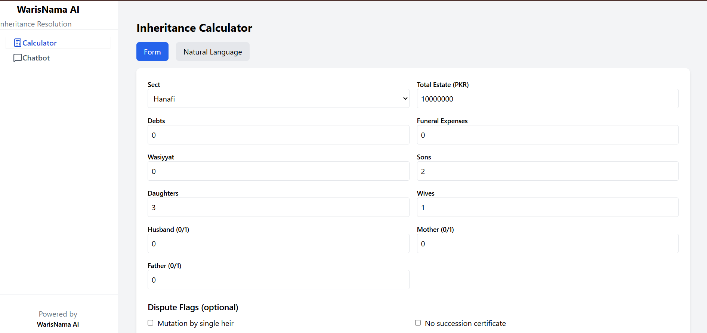
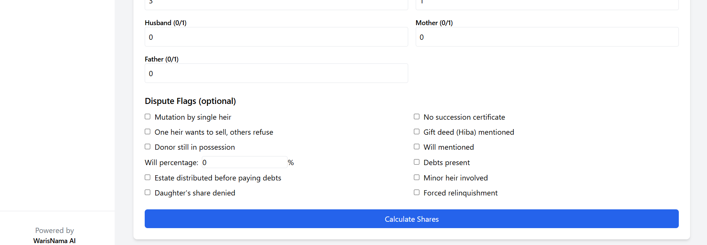
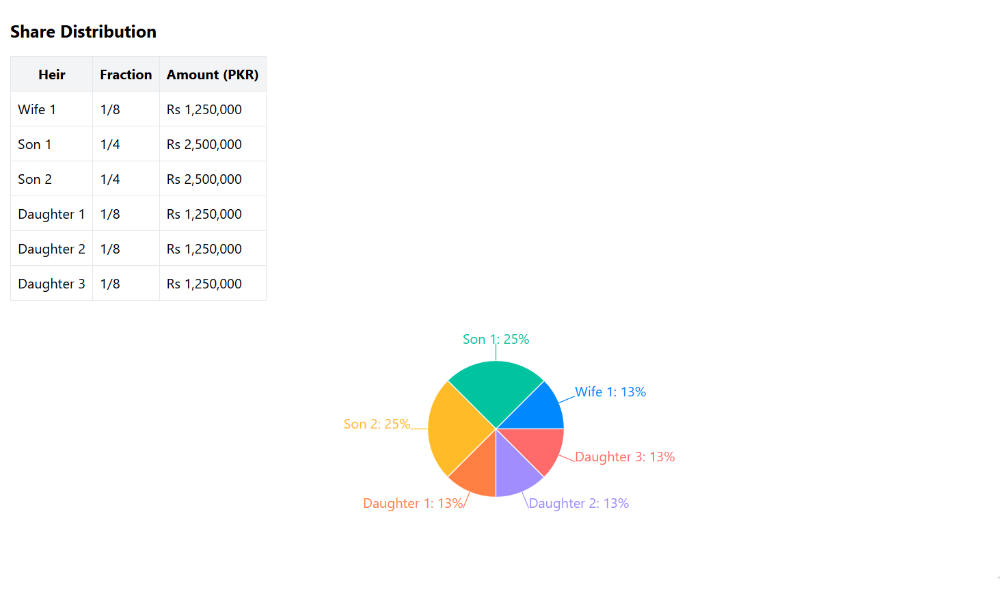
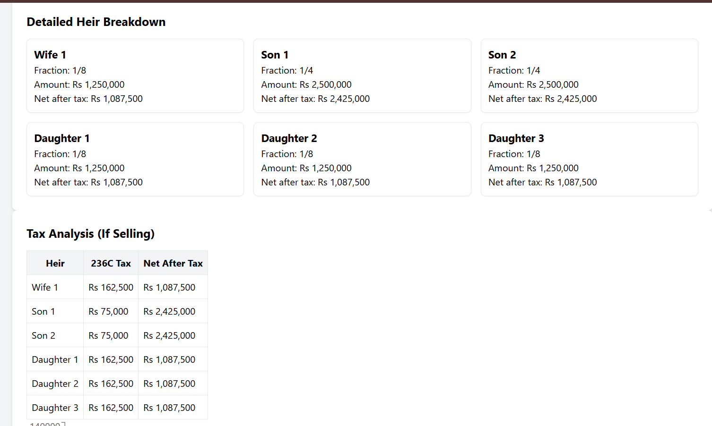
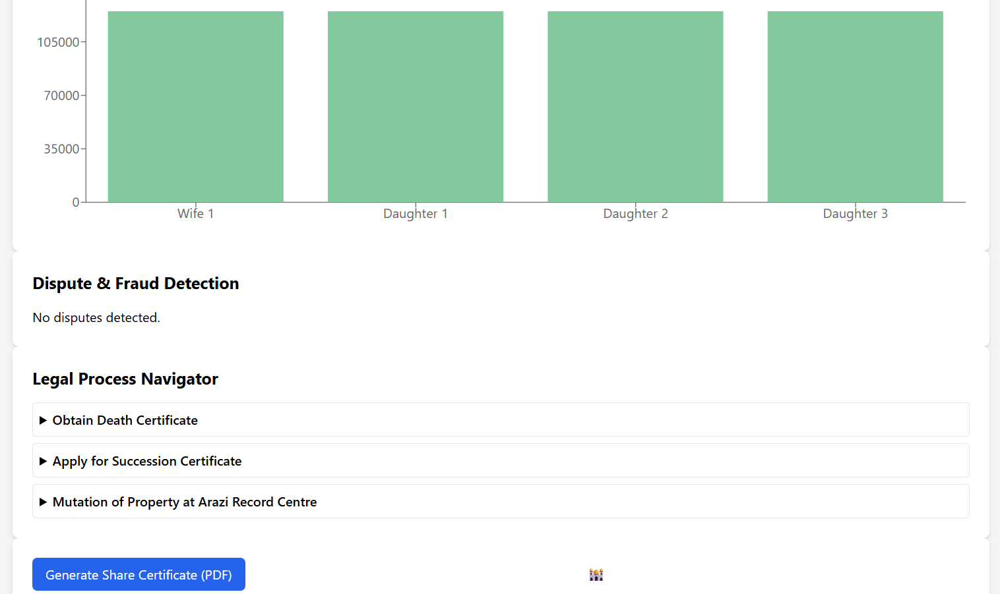
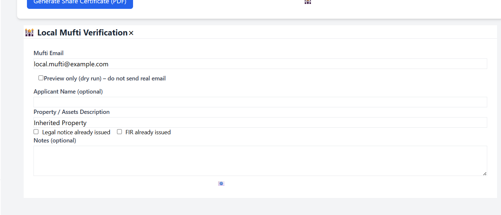
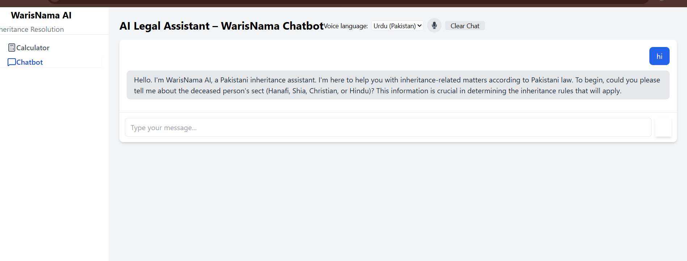

# ⚖️ WarisNama AI

## AI-Powered Pakistani Inheritance Dispute Resolution System  

[](https://fastapi.tiangolo.com)
[](https://reactjs.org)
[](https://tailwindcss.com)
[](https://groq.com)
[](LICENSE)

---

## 📌 Overview

Pakistan has **over 2 million pending court cases** – inheritance disputes are among the top drivers.  
A widow, a daughter, or a grandson often loses their legally guaranteed share – **not because the law fails them, but because they cannot read an Intiqal document, cannot afford a lawyer, and do not know what they are owed.**

**WarisNama AI** solves this in under 60 seconds.  
It calculates legal shares according to **Hanafi, Shia, Christian, and Hindu** laws, detects **7 common fraud patterns**, computes **FBR 2025 taxes**, generates **bilingual legal documents (Urdu/English)**, and provides an **AI chatbot** (Groq) that asks clarifying questions and builds a complete inheritance scenario – all for free.

> **No inheritance tax in Pakistan** – WarisNama AI clarifies this immediately, often the single most impactful piece of information for a grieving family.

---

## ✨ Features

| Category | Features |
|----------|----------|
| **Inheritance Calculation** | ✅ Sunni Hanafi (MFLO 1961 §4) – most commonly exploited rule<br>✅ Shia Jafari (wife excludes land)<br>✅ Christian (Succession Act 1925) – no gender bias<br>✅ Hindu (Class I heirs) |
| **Fraud Detection** | ✅ 8 fraud patterns (fraudulent mutation, forced sale, invalid Hiba, excessive will, debt priority, minor heir, buy‑out, daughter’s share denied)<br>✅ Fraud score (0–100) + legal remedies + criminal law references (PPC 498A) |
| **Tax Engine (FBR 2025)** | ✅ Section 236C (seller), 236K (buyer)<br>✅ CGT step‑up basis for inherited property<br>✅ CVT, stamp duty, registration fee<br>✅ **Zero inheritance tax** – explicit note |
| **Legal Documents (PDF)** | ✅ Share certificate (bilingual)<br>✅ Legal notice (English / Urdu)<br>✅ FIR draft (Urdu) |
| **Process Navigator** | ✅ Step‑by‑step NADRA / court guidance<br>✅ Special handling for minor heirs and disputes |
| **AI Chatbot** | ✅ Conversational (Groq Llama 3.3 70B)<br>✅ Understands Urdu, English, Roman Urdu<br>✅ Extracts complete scenario → calculates shares with one click |
| **User Interface** | ✅ Form + Natural Language input (regex fallback, Gemini optional)<br>✅ Voice input (Web Speech API – Urdu/English)<br>✅ Interactive charts (pie, bar) + heir breakdown cards<br>✅ CSV export of shares and tax report |

---

## 🛠️ Tech Stack

| Layer | Technology |
|-------|------------|
| **Frontend** | React 18, React Router, Zustand, TailwindCSS, Axios, Recharts, React Hook Form, React Hot Toast, Lucide Icons |
| **Backend** | FastAPI, Uvicorn, Pydantic, Python‑dotenv |
| **AI / NLP** | Groq (Llama 3.3 70B), Google Gemini (optional fallback) |
| **PDF Generation** | ReportLab |
| **Voice Input** | Web Speech API (browser native) |
| **Email (Verification)** | SMTP (Gmail / custom) |
| **Deployment** | Vite (frontend), Uvicorn (backend) |

---

## 📁 Project Structure
```python

```
├── 📁 ai
│   ├── 🐍 __init__.py
│   ├── 🐍 chatbot.py
│   ├── 🐍 doc_generator.py
│   ├── 🐍 nlp_parser.py
│   ├── 🐍 test_gemini_simple.py
│   └── 🐍 urdu_explainer.py
├── 📁 backend
│   └── 📁 app
│       ├── 📁 api
│       │   ├── 📁 v1
│       │   │   ├── 📁 routes
│       │   │   │   ├── 🐍 __init__.py
│       │   │   │   ├── 🐍 chat_routes.py
│       │   │   │   ├── 🐍 dispute_routes.py
│       │   │   │   ├── 🐍 document_routes.py
│       │   │   │   ├── 🐍 inheritance_routes.py
│       │   │   │   ├── 🐍 nlp_routes.py
│       │   │   │   ├── 🐍 process_routes.py
│       │   │   │   ├── 🐍 tax_routes.py
│       │   │   │   └── 🐍 verify_routes.py
│       │   │   ├── 🐍 __init__.py
│       │   │   └── 🐍 api.py
│       │   └── 🐍 __init__.py
│       ├── 📁 core
│       │   ├── 🐍 __init__.py
│       │   ├── 🐍 config.py
│       │   └── 🐍 logger.py
│       ├── 📁 schemas
│       │   ├── 🐍 __init__.py
│       │   ├── 🐍 common.py
│       │   ├── 🐍 document_schemas.py
│       │   ├── 🐍 inheritance_schemas.py
│       │   └── 🐍 nlp_schemas.py
│       ├── 📁 services
│       │   ├── 🐍 __init__.py
│       │   ├── 🐍 chat_service.py
│       │   ├── 🐍 dispute_service.py
│       │   ├── 🐍 document_service.py
│       │   ├── 🐍 inheritance_service.py
│       │   ├── 🐍 local_mufti_verification.py
│       │   ├── 🐍 nlp_service.py
│       │   ├── 🐍 process_service.py
│       │   └── 🐍 tax_service.py
│       ├── 🐍 __init__.py
│       └── 🐍 main.py
├── 📁 core
│   ├── 🐍 __init__.py
│   ├── 🐍 dispute_detector.py
│   ├── 🐍 faraid_engine.py
│   ├── 🐍 knowledge_base.py
│   ├── 🐍 process_navigator.py
│   ├── 🐍 scenario_types.py
│   └── 🐍 tax_engine.py
├── 📁 data
│   ├── ⚙️ fbr_rates_2025.json
│   ├── ⚙️ legal_references.json
│   └── ⚙️ nadra_process.json
├── 📁 docs
│   ├── 📁 fonts
│   │   └── 📄 NotoNastaliqUrdu.ttf
│   ├── 📁 templates
│   │   ├── 📕 WarisNama_AI_Complete_Blueprint..pdf
│   │   ├── 🐍 __init__.py
│   │   ├── 🐍 fir_draft.py
│   │   ├── 🐍 legal_notice.py
│   │   └── 🐍 share_certificate.py
│   ├── 🐍 __init__.py
│   └── 🐍 pdf_builder.py
├── 📁 frontend
│   ├── 📁 public
│   ├── 📁 src
│   │   ├── 📁 app
│   │   │   ├── 📄 App.jsx
│   │   │   └── 📄 store.jsx
│   │   ├── 📁 components
│   │   │   ├── 📁 common
│   │   │   │   ├── 📄 Button.jsx
│   │   │   │   ├── 📄 Input.jsx
│   │   │   │   ├── 📄 Loader.jsx
│   │   │   │   └── 📄 VoiceButton.jsx
│   │   │   └── 📁 layout
│   │   │       ├── 📄 Layout.jsx
│   │   │       └── 📄 Sidebar.jsx
│   │   ├── 📁 features
│   │   │   ├── 📁 calculator
│   │   │   │   ├── 📁 components
│   │   │   │   │   └── 📄 MuftiVerificationModal.jsx
│   │   │   │   ├── 📁 pages
│   │   │   │   │   └── 📄 CalculatorPage.jsx
│   │   │   │   ├── 📁 services
│   │   │   │   │   └── 📄 calculatorService.js
│   │   │   │   └── 📁 utils
│   │   │   │       └── 📄 certificateHelper.js
│   │   │   └── 📁 chatbot
│   │   │       ├── 📁 components
│   │   │       │   └── 📄 ChatWindow.jsx
│   │   │       ├── 📁 hooks
│   │   │       │   └── 📄 useChatbot.js
│   │   │       ├── 📁 pages
│   │   │       │   └── 📄 ChatbotPage.jsx
│   │   │       └── 📁 services
│   │   │           └── 📄 chatbotService.js
│   │   ├── 📁 hooks
│   │   │   └── 📄 useApi.js
│   │   ├── 📁 pages
│   │   │   └── 📄 NotFound.jsx
│   │   ├── 📁 routes
│   │   │   └── 📄 AppRoutes.jsx
│   │   ├── 📁 services
│   │   │   ├── 📄 api.js
│   │   │   └── 📄 endpoints.js
│   │   ├── 📁 utils
│   │   ├── 🎨 index.css
│   │   ├── 📄 main.jsx
│   │   └── 🎨 tailwind-output.css
│   ├── ⚙️ .gitignore
│   ├── 🌐 index.html
│   ├── ⚙️ package-lock.json
│   ├── ⚙️ package.json
│   ├── 📄 postcss.config.js
│   ├── 📄 tailwind.config.js
│   └── 📄 vite.config.js
├── 📁 tests
│   ├── 🖼️ WhatsApp Image 2026-04-22 at 10.21.05 PM.jpeg
│   ├── 🖼️ WhatsApp Image 2026-04-22 at 10.21.15 PM.jpeg
│   ├── 🖼️ WhatsApp Image 2026-04-22 at 10.21.24 PM.jpeg
│   ├── 🖼️ WhatsApp Image 2026-04-22 at 10.21.33 PM.jpeg
│   ├── 🖼️ WhatsApp Image 2026-04-22 at 10.21.43 PM.jpeg
│   ├── 🖼️ WhatsApp Image 2026-04-22 at 10.21.53 PM.jpeg
│   ├── 🖼️ WhatsApp Image 2026-04-22 at 10.22.02 PM.jpeg
│   ├── 🖼️ WhatsApp Image 2026-04-22 at 10.22.21 PM.jpeg
│   ├── 🖼️ WhatsApp Image 2026-04-22 at 10.23.45 PM.jpeg
│   ├── 🖼️ WhatsApp Image 2026-04-22 at 10.23.53 PM.jpeg
│   ├── 🖼️ WhatsApp Image 2026-04-22 at 10.24.03 PM.jpeg
│   ├── 🖼️ WhatsApp Image 2026-04-22 at 10.24.15 PM.jpeg
│   ├── 🖼️ WhatsApp Image 2026-04-22 at 10.24.24 PM.jpeg
│   ├── 🐍 test_disputes.py
│   └── 🐍 test_faraid.py
├── 📁 ui
│   ├── 🐍 __init__.py
│   ├── 🐍 dispute_panel.py
│   ├── 🐍 intake_wizard.py
│   ├── 🐍 results_dashboard.py
│   ├── 🐍 voice_interface.py
│   └── 🐍 whatif_simulator.py
├── ⚙️ .gitignore
├── 📝 README.md
├── 🐍 app.py
├── 🖼️ image-1.png
├── 🖼️ image-2.png
├── 🖼️ image-3.png
├── 🖼️ image-4.png
├── 🖼️ image-5.png
├── 🖼️ image-6.png
├── 🖼️ image.png
└── 📄 requirements.txt
```

```

> **Note:** The `core/`, `ai/`, and `docs/` directories are **shared** between the Streamlit app and the FastAPI backend. The backend imports them directly (no duplication).

---

## 🚀 Installation & Setup

### Prerequisites

- Python 3.9+
- Node.js 18+
- npm or yarn
- Git

### 1. Clone the repository

```bash
git clone https://github.com/yourusername/WarisNama-AI.git
cd WarisNama-AI
```


### 2. Backend Setup
```bash
cd backend
python -m venv venv
source venv/bin/activate      # On Windows: .\venv\Scripts\activate
pip install -r requirements.txt
```
Create a .env file inside backend/ (see example below).

Run the backend server:

``` bash
uvicorn app.main:app --reload
```
The API will be available at http://localhost:8000.
Interactive API docs: http://localhost:8000/docs

### 3. Frontend Setup
Open a new terminal:

```bash
cd frontend
npm install
npm run dev
```

The frontend will be available at http://localhost:3000.


### 4. Environment Variables (Backend)

> Create backend/.env:

```bash
# General
ENVIRONMENT=development
LOG_LEVEL=INFO

# Groq API (for chatbot – get a free key from console.groq.com)
GROQ_API_KEY=your_groq_api_key

# Google Gemini (optional – for NLP fallback)
GEMINI_API_KEY=your_gemini_api_key

# SMTP (for verification email, optional)
SMTP_SERVER=smtp.gmail.com
SMTP_PORT=587
SMTP_EMAIL=your_email@gmail.com
SMTP_PASSWORD=your_app_password

```

> The chatbot works without Gemini; the NLP parser will fall back to a robust regex parser.


# 🧪 Usage

## Using the Web App

1. Open `http://localhost:3000` in your browser.

2. **Calculator page** – fill the form or switch to Natural Language mode.

3. Describe the situation in Urdu/English, e.g.:
   > "My father died. 2 sons, 3 daughters, 1 wife. House worth 80 lakh."

4. Click **Parse Scenario** → the form auto‑populates → click **Calculate Shares**.

5. View the results in tabs:
   - **Shares** – table, pie chart, heir cards
   - **Tax** – per‑heir 236C tax, savings if filer
   - **Disputes** – fraud score, legal actions
   - **Documents** – download share certificate (PDF), legal notice, FIR draft

6. On the **Chatbot page**, you can converse (voice input supported) and ask the AI to build a scenario; then click **Calculate Shares from Chat** to see the results in the calculator tab.

## API Usage (Example)

Calculate shares (`POST /api/v1/calculate/`)

```bash
curl -X POST http://localhost:8000/api/v1/calculate/ \
  -H "Content-Type: application/json" \
  -d '{
    "sect": "hanafi",
    "heirs": {"sons": 2, "daughters": 3, "wife": 1},
    "total_estate": 8000000,
    "debts": 0,
    "funeral": 0,
    "wasiyyat": 0
  }'

```
> Chatbot (POST /api/v1/chat/):

```bash
curl -X POST http://localhost:8000/api/v1/chat/ \
  -H "Content-Type: application/json" \
  -d '{"message": "My father died with 2 sons and 3 daughters"}'
```

## 📚 API Endpoints (Summary)

| Endpoint | Method | Description |
|----------|--------|-------------|
| `/api/v1/calculate/` | POST | Inheritance shares calculation |
| `/api/v1/nlp/parse` | POST | Natural language → structured data |
| `/api/v1/dispute/detect` | POST | Fraud detection (flags → patterns) |
| `/api/v1/tax/calculate` | POST | Per‑heir tax (FBR 2025) |
| `/api/v1/process/steps` | POST | NADRA / court process steps |
| `/api/v1/chat/` | POST | AI chatbot (Groq) |
| `/api/v1/documents/share-certificate` | POST | PDF (share certificate) |
| `/api/v1/documents/legal-notice` | POST | PDF (legal notice) |
| `/api/v1/documents/fir` | POST | PDF (FIR draft) |
| `/api/v1/verify/send-to-mufti` | POST | Email PDF to mufti (optional) |

Full interactive documentation available at `http://localhost:8000/docs`.


## 🔮 Future Improvements

- Redis session store – scale chatbot horizontally.
- User authentication & audit logs – track calculations per user.
- Lawyer referral marketplace – connect users with local lawyers.
- OCR for Intiqal/Fard documents – automatically extract heirs and property details.
- WhatsApp bot – for users without smartphone browsers.
- What‑If simulator – compare buy‑out, sale, or exclusion scenarios.
- Full MFLO §4 support – predeceased son’s grandchildren (already partially supported in core).

## 🤝 Contributing

Contributions are welcome! Please follow these steps:

1. Fork the repository.
2. Create a new branch: `git checkout -b feature/your-feature-name`
3. Make your changes and commit: `git commit -m 'Add some feature'`
4. Push to the branch: `git push origin feature/your-feature-name`
5. Open a Pull Request.

For major changes, please open an issue first to discuss what you would like to change.

## 📄 License

This project is licensed under the MIT License – see the LICENSE file for details.

## 🙏 Acknowledgements

- Mulla's Mohammedan Law – Hanafi Faraid rules
- Zafar & Associates – Shia Jafari guidance
- Groq – free, fast LLM (Mixtral / Llama 3)
- Google Gemini – optional NLP
- ReportLab – PDF generation









